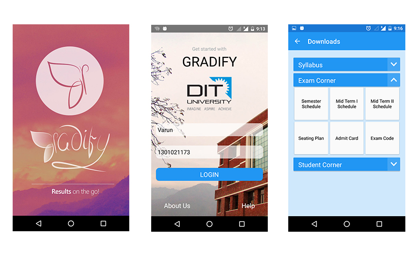
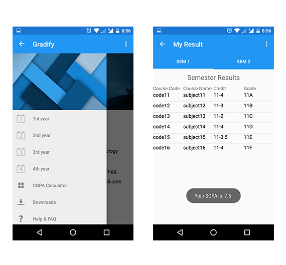

# GRADIFY - An Android Application
### An intuitive mobile app to enable students to view their results anytime, anywhere.


Gradify is an Android application to display and store results of a student of all the examinations of the university. The project allows the user to view their individual results in the exams seamlessly in their mobile phones on the ! 
It basically solves problems of conventional result display system such as:
- **Overcrowding at the notice boards.** 
- **Results being torn.** 
- **During vacations students aren’t able to check their results.**
- **Poor portability of storing results and lack of notifications on declaration of results.** 

## Features

- Personallized experience for every user to view their results and info on the go.
- Semester wise results in same format as in marksheets.
- Simple login by Student's name and unique roll number.
- Seperate download section to download important/frequently used documents asyuchronously on the device.
- Powered by **Microsoft Azure's** cloud storage and web-service making it robust and scalable.
- A CGPA Calculator to calculate a student's expected CGPA using accurate formulae.
- Intuitive and simple user interface.
- Push notifications to update about the results, announcements, etc.
- Help and FAQ section to provide assistance.



## Configuring the project

Simply download/clone the project on the system and import it in Android Studio.
Now we need to configure the project. 

**SDK Version**

Now you will see that gradle cannot be sync because it missing some parameters. Open to **gradle.properties** file in the root of the project and add the following lines.

```
MIN_SDK = 15
ANDROID_BUILD_SDK_VERSION = 23
ANDROID_BUILD_TOOLS_VERSION = 21.1.0
ANDROID_BUILD_TARGET_SDK_VERSION = 23
ANDROID_COMPILE_SDK_VERSION = 23
```
> **Note:**
>You should make sure that the correct SDK versions and build tools are installed in Android Studio. To do this open the Preferences panel and navigate to **Appearance & Behavour** -> **System Settings** -> **Android SDK** or click on the **SDK Manager** icon in the tool bar. Android SDK versions 4.4 and onwards should be installed. **Android SDK Build-Tools** version 21.1.0 should be installed. 

**Update Gradle**

Next open the **build.gradle** file for your project. It should be called **build.gradle (Project: Your-project-name)**  

Update this file by adding the following.    

buildscript {  
    repositories {  
        jcenter()  
    }  
    dependencies {  
        classpath 'com.android.tools.build:gradle:1.2.3'  

        // NOTE: Do not place your application dependencies here; they belong  
        // in the individual module build.gradle files  
    }  
}  

allprojects {  
    repositories {  
        jcenter()  
    }  
}  

Now run Gradle to get the project ready to be compiled. The project should now compile without error.   

## Team
-**Deepank Srivastava** | deepank@outlook.com

-**Varun Dhall** | varunvd1994@gmail.com

-**Arshdeep Kaur Gulati** | arshdeepkaurgulati@gmail.com
